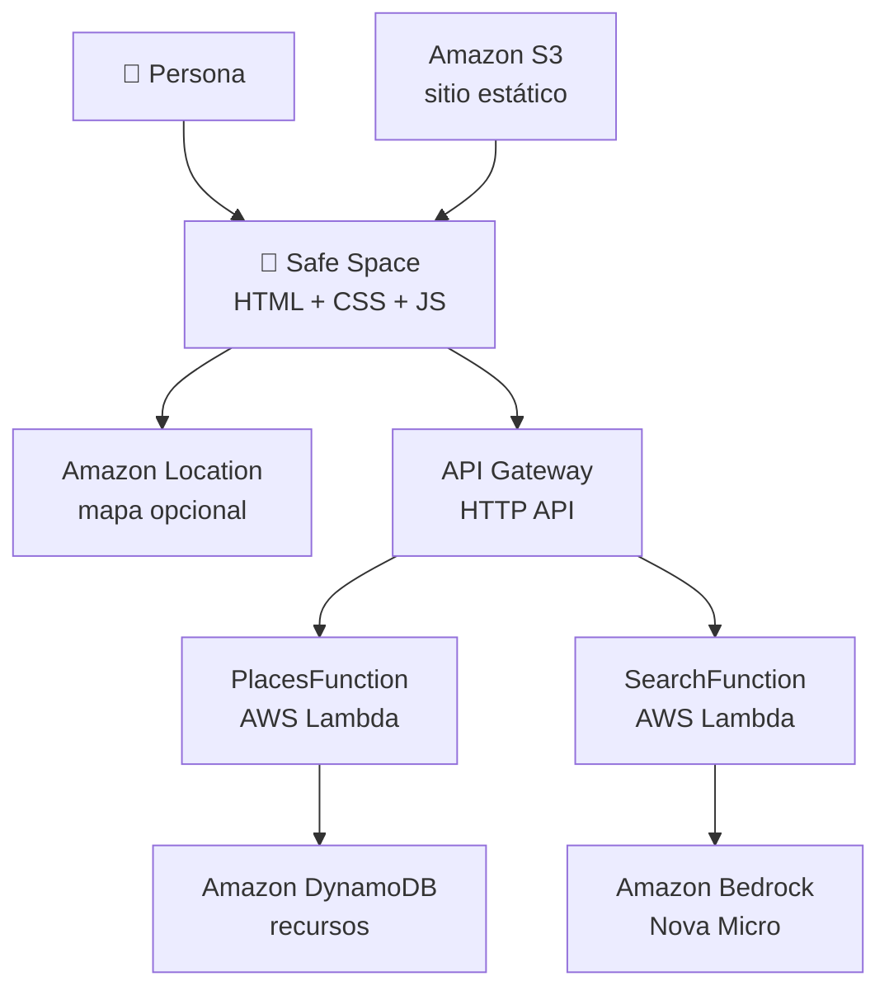

# 🌈 Safe Space

**Directorio de recursos inclusivos con procedencia visible · Ciudad de México**

Workshop de [AWSpectrum LATAM](https://linktr.ee/awspectrum.latam) · *Cloud • Community • Diversity*

Safe Space ayuda a encontrar organizaciones, servicios de apoyo, centros comunitarios y canales de
derivación. Algunos recursos tienen una ubicación pública y aparecen en el mapa; otros funcionan por
teléfono, chat o canalización y se muestran únicamente como fichas de contacto.

> **Safe Space no certifica que un recurso sea universalmente seguro ni que esté disponible en todo
> momento.** El directorio muestra la fuente, la fecha de revisión y el estado de publicación. Las
> derivaciones a refugios nunca publican la dirección protegida.

## Qué vas a construir

En tres horas vas a desplegar, inspeccionar, entender y modificar una aplicación serverless real en
AWS. No la escribes desde cero: el objetivo es poder contar la historia de una petición y explicar
por qué cada servicio existe.



| Servicio | Para qué lo usamos |
| --- | --- |
| **Amazon S3** | Alojar la interfaz estática. |
| **Amazon Location** | Dibujar ubicaciones públicas, fuera del flujo de datos de la API. |
| **API Gateway HTTP API** | Exponer `/resources` y `/search`. |
| **AWS Lambda** | Validar propuestas y extraer intención de búsqueda. |
| **Amazon DynamoDB** | Persistir recursos aprobados y propuestas pendientes. |
| **Amazon Bedrock · Nova Micro** | Convertir lenguaje natural en criterios permitidos. |
| **AWS SAM** | Describir y desplegar toda la infraestructura. |

Todo vive en **`us-east-1`**.

## Puesta en marcha

Abre AWS CloudShell en `us-east-1` y ejecuta:

```bash
git clone https://github.com/itsebasvz/awspectrum-safe-space.git
cd awspectrum-safe-space

./scripts/preflight.sh
sam build
sam deploy
./scripts/publish-frontend.sh
python3 scripts/seed.py
```

`publish-frontend.sh` imprime la URL de tu aplicación. El seed contiene recursos aprobados con
fuentes directas revisadas; las propuestas nuevas no se publican automáticamente.

Para reemplazar expresamente todo el contenido anterior de la tabla:

```bash
python3 scripts/seed.py --replace
```

`--replace` es deliberado: elimina los items existentes antes de cargar la semilla nueva.

## Las rutas de la API

```text
GET  /resources  → devuelve recursos aprobados
POST /resources  → guarda una propuesta como pending
POST /search     → convierte lenguaje natural en criterios
```

Obtén la URL de tu stack:

```bash
API=$(aws cloudformation describe-stacks --stack-name safe-space \
      --query "Stacks[0].Outputs[?OutputKey=='ApiUrl'].OutputValue" --output text)
```

Lista recursos:

```bash
curl "$API/resources"
```

Busca apoyo:

```bash
curl -X POST "$API/search" -H 'content-type: application/json' \
  -d '{"query":"necesito apoyo psicológico para una persona trans y quiero saber a dónde llamar"}'
```

Una respuesta típica tiene esta forma:

```json
{
  "query": "necesito apoyo psicológico para una persona trans",
  "criteria": {
    "category": "support_service",
    "services": ["psychological_support"],
    "signals": ["trans_inclusive"]
  },
  "source": "bedrock"
}
```

Si Bedrock falla, `source` cambia a `fallback` y la extracción determinista mantiene el flujo.

## Contrato de un recurso

```json
{
  "id": "usipt-cdmx",
  "name": "USIPT · Unidad de Salud Integral para Personas Trans",
  "category": "support_service",
  "services": ["psychological_support", "legal_support", "healthcare"],
  "signals": ["trans_inclusive"],
  "address": "solo si la ubicación es pública",
  "latitude": 19.4545577,
  "longitude": -99.1509918,
  "contact": {
    "phone": "55 5132 1250",
    "website": "https://…"
  },
  "provenance": {
    "type": "direct_source",
    "sourceUrl": "https://…",
    "checkedAt": "2026-08-19"
  },
  "publicationStatus": "approved"
}
```

`latitude` y `longitude` son opcionales, pero deben aparecer juntas. Una `shelter_referral` no
puede tener dirección ni coordenadas: la seguridad de quien usa el refugio está por encima de la
completitud del mapa.

Los registros aprobados requieren `provenance.type = "direct_source"`, `sourceUrl` y `checkedAt`.
Una propuesta enviada desde el formulario recibe `publicationStatus = "pending"` y
`provenance.type = "community_submission"`; nunca se presenta como verificada.

## Qué hace —y qué no hace— la IA

Bedrock convierte una frase en `{category, services, signals}`. No consulta DynamoDB, no elige
recursos, no inventa teléfonos y no afirma que una organización esté abierta o disponible.

La allowlist de `template.yaml` valida la respuesta antes de que llegue al navegador. Después,
`frontend/app.js` filtra los recursos aprobados. La IA interpreta; el código decide.

## Taxonomía

La fuente de verdad vive en `template.yaml`:

- categorías: `organization`, `support_service`, `community_center`, `shelter_referral`;
- servicios: `psychological_support`, `legal_support`, `healthcare`, `referral`,
  `community_network`, `shelter_support`;
- señales: `lgbtq_affirming`, `trans_inclusive`, `free`, `open_24_7`, `contact_only`.

La plantilla pasa las tres listas a las Lambdas y `publish-frontend.sh` las escribe en
`frontend/config.js`. Ese archivo está en `.gitignore` porque contiene la API key de Amazon
Location y nunca debe commitearse.

## Probar cambios

Comprobaciones locales sin tocar AWS:

```bash
python3 -m unittest discover -s tests -v
node --check frontend/app.js
sam validate --lint
```

Para modificar código de Lambda durante el workshop:

```bash
sam sync --code
```

Para modificar la infraestructura o la taxonomía:

```bash
sam deploy
./scripts/publish-frontend.sh
```

El reto recomendado es añadir una ficha de contacto o derivación sin coordenadas y demostrar que
aparece en el directorio, pero no como pin.

## Workshop vs. producción

| En el workshop | En producción |
| --- | --- |
| Sitio estático público de S3 | HTTPS con CloudFront o Amplify y bucket privado |
| API sin autenticación | Autenticación, autorización y límites de tasa |
| `Scan` de DynamoDB sobre pocos recursos | Índices y patrones de acceso diseñados |
| Seed aprobado + propuestas `pending` | Moderación, auditoría y proceso de actualización |
| Coordenadas solo cuando son públicas | Revisión de privacidad y amenaza por recurso |
| Una base de datos por participante | Backend comunitario compartido |

## Limpieza

El cleanup es parte del workshop:

```bash
./scripts/cleanup.sh
```

Vacía el bucket y ejecuta `sam delete`. Antes de borrar recursos de una cuenta compartida, confirma
que la stack no esté siendo utilizada.

## Licencia

[MIT](LICENSE)
