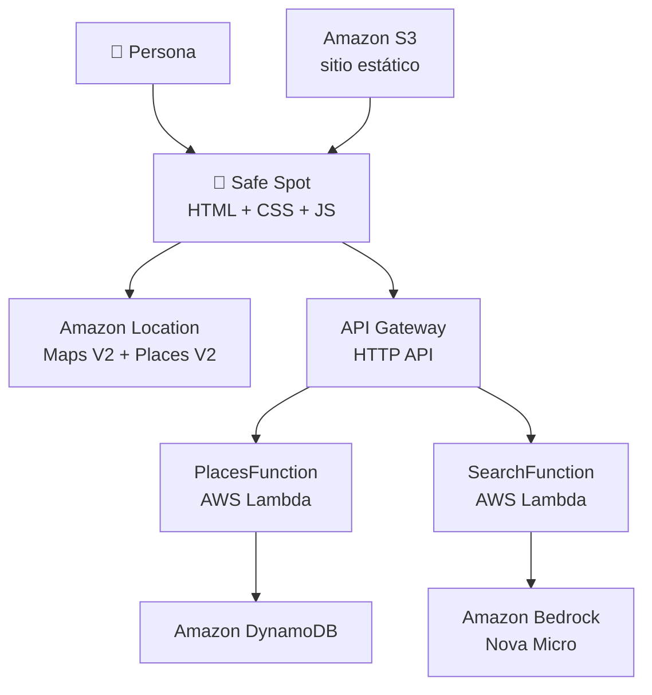

# 🌈 Safe Spot

**Mapa comunitario de espacios inclusivos para la comunidad LGBTQ+ · Ciudad de México**

Workshop de [AWS Spectrum LATAM](https://linktr.ee/awspectrum.latam) · *Cloud • Community • Diversity*

En las próximas tres horas vas a desplegar, inspeccionar, entender y modificar una aplicación
serverless real en tu propia cuenta de AWS. No vas a escribirla desde cero: el objetivo es que al
terminar puedas **contar la historia de cómo viaja una petición por el sistema** y por qué existe cada
servicio.

---

## Qué hace Safe Spot

Un mapa convencional responde muy bien *dónde está un lugar*. No responde lo que a veces más importa:
¿tiene baño neutral?, ¿respetan pronombres?, ¿es accesible?, ¿la comunidad lo reporta como cómodo
para ir en pareja?

Safe Spot combina tres cosas: **ubicación** (Amazon Location), **información comunitaria**
(DynamoDB) y **búsqueda en lenguaje natural** (Amazon Bedrock).

> **Safe Spot no certifica que un lugar sea universalmente seguro.** Recoge señales reportadas por la
> comunidad, con su procedencia y su fecha. Esa distinción es parte del producto.

### Qué hace —y qué no hace— la IA

Escribes esto:

> *«Busco un café tranquilo para una cita con mi novia y me importa que tenga baño neutral.»*

Y Amazon Bedrock devuelve **solo esto**:

```json
{ "category": "cafe", "signals": ["neutral_bathroom", "quiet"] }
```

Ahí termina su trabajo. El modelo **no elige lugares, no consulta la base de datos y no inventa
espacios**. Nuestro código valida esa respuesta contra una lista de señales permitidas y el navegador
busca coincidencias entre los lugares que ya existen en tu tabla.

Es una separación deliberada: **la IA interpreta la necesidad, la comunidad aporta la información y
el código toma la decisión final.**

---

## Arquitectura



| Servicio | Para qué lo usamos |
| --- | --- |
| **Amazon S3** | Alojar el frontend estático. |
| **Amazon Location** | Renderizar el mapa y normalizar ubicaciones. |
| **API Gateway HTTP API** | Exponer `GET /places`, `POST /places` y `POST /search`. |
| **AWS Lambda** | Dos funciones pequeñas: lugares y búsqueda. |
| **Amazon DynamoDB** | Persistir espacios y señales comunitarias. |
| **Amazon Bedrock · Nova Micro** | Extraer intención desde lenguaje natural. |
| **AWS SAM** | Describir y desplegar toda la infraestructura. |
| **AWS CloudShell** | El mismo entorno para todo el mundo, sin instalar nada. |

Todo vive en **`us-east-1`**. Una sola región evita el error más común del workshop: tener la Lambda
en un sitio, Bedrock en otro y el mapa en un tercero.

---

## Puesta en marcha

Abre **AWS CloudShell** en `us-east-1` y ejecuta:

```bash
git clone https://github.com/itsebasvz/safe-spot-aws-spectrum.git
cd safe-spot-aws-spectrum

./scripts/preflight.sh          # comprueba tu entorno. Solo lee, no cambia nada.
sam build                       # ~2 s
sam deploy                      # ~1 min 10 s
./scripts/publish-frontend.sh   # genera config.js y sube el sitio a S3
python3 scripts/seed.py         # carga los 18 lugares en DynamoDB
```

`publish-frontend.sh` te imprime la URL de tu Safe Spot al terminar. Ábrela.

<details>
<summary><strong>¿Qué hace cada comando?</strong></summary>

| Comando | Qué ocurre por debajo |
| --- | --- |
| `preflight.sh` | Verifica credenciales, región, herramientas, acceso a Bedrock y a Location, y si algo de tu cuenta bloquearía el despliegue. **Reporta problemas; no los arregla por su cuenta.** |
| `sam build` | Prepara el código de las Lambdas en `.aws-sam/build/`. Tarda un par de segundos porque no hay dependencias que instalar. |
| `sam deploy` | SAM traduce `template.yaml` a CloudFormation y CloudFormation crea la stack. Míralo en la consola: **CloudFormation → Stacks → safe-spot**. |
| `publish-frontend.sh` | Lee los Outputs de la stack, obtiene el **valor** de la API key de Amazon Location (CloudFormation crea la key pero no revela su valor), escribe `frontend/config.js` y sincroniza la carpeta al bucket. |
| `seed.py` | Valida `data/seed.json` contra la taxonomía real de tu stack y lo escribe en DynamoDB. Es idempotente: puedes repetirlo. |

</details>

---

## Las tres rutas

```
GET  /places   → lee todos los espacios
POST /places   → registra un espacio nuevo
POST /search   → convierte lenguaje natural en criterios
```

Pruébalas desde CloudShell. Sustituye `$API` por el Output `ApiUrl` de tu stack:

```bash
API=$(aws cloudformation describe-stacks --stack-name safe-spot \
      --query "Stacks[0].Outputs[?OutputKey=='ApiUrl'].OutputValue" --output text)

curl "$API/places" | head -c 400

curl -X POST "$API/search" -H 'content-type: application/json' \
  -d '{"query":"un bar lésbico donde pueda ir con mi pareja"}'
```

Deberías ver algo así:

```json
{
  "query": "un bar lésbico donde pueda ir con mi pareja",
  "criteria": { "category": "bar", "signals": ["lgbtq_space", "couples_friendly"] },
  "source": "bedrock"
}
```

Ese `source` es importante. Si Bedrock no responde —permisos, cuota, un fallo pasajero— la función
**no devuelve un error**: cae a una extracción por palabras clave y marca `"source": "fallback"`. La
aplicación sigue funcionando y tú puedes seguir con el workshop.

---

## Estructura del repo

```
safe-spot-aws-spectrum/
├── template.yaml            # el plano: todos los recursos de AWS
├── samconfig.toml           # para que 'sam deploy' no haga preguntas
│
├── functions/
│   ├── places/app.py        # GET /places · POST /places → DynamoDB
│   └── search/app.py        # POST /search → Bedrock + validación
│
├── frontend/
│   ├── index.html
│   ├── styles.css
│   ├── app.js               # donde el navegador toca AWS
│   └── config.example.js    # config.js real lo genera publish-frontend.sh
│
├── data/seed.json           # 18 espacios de CDMX con su procedencia
│
└── scripts/
    ├── preflight.sh
    ├── seed.py
    ├── publish-frontend.sh
    └── cleanup.sh
```

### Una sola fuente de verdad para la taxonomía

Las señales de inclusión (`lgbtq_space`, `neutral_bathroom`, `accessible`, …) están declaradas **una
vez**, en el parámetro `AllowedSignals` de `template.yaml`. De ahí llegan:

- a las dos Lambdas, por variable de entorno;
- al frontend, a través de un Output de la stack que `publish-frontend.sh` escribe en `config.js`.

Por eso añadir una señal nueva es cambiar una línea y volver a desplegar. Los filtros y el formulario
aparecen solos.

---

## Experimentar

Durante la fase de experimentación, para cambios en el **código** de las Lambdas:

```bash
sam sync --code
```

Sube solo el código, en un par de segundos, sin rehacer la infraestructura. Te pedirá confirmar que
es una stack de desarrollo: responde `Y`. (Te avisa porque `sync` provoca *drift* respecto a
CloudFormation. En una stack de producción no lo harías.)

Si cambias `template.yaml` —por ejemplo para añadir una señal— entonces sí necesitas `sam deploy`.

**Cosas que merece la pena probar:**

1. Añade una señal a `AllowedSignals` en `template.yaml`, despliega y mira cómo aparece sola en los
   filtros y en el formulario. Añádele una etiqueta bonita en `SIGNAL_LABELS` de `frontend/app.js`.
2. Cambia el `SYSTEM_PROMPT` de `functions/search/app.py` y observa cómo cambia la interpretación.
   Fíjate en que, hagas lo que hagas, `validate_criteria()` sigue descartando lo que no está en la
   allowlist.
3. Manda a `POST /places` una señal inventada y mira qué responde la API.
4. Abre **CloudWatch → Log groups → /aws/lambda/safe-spot-search** y sigue una petición.

---

## Limpieza

El cleanup es parte del workshop, no una nota al pie.

```bash
./scripts/cleanup.sh
```

Vacía el bucket del sitio —CloudFormation no puede borrar un bucket con objetos dentro— y ejecuta
`sam delete`. Se lleva la API, las Lambdas, la tabla, la API key y los log groups.

Compruébalo en **CloudFormation → Stacks**: `safe-spot` ya no debería aparecer.

---

## Workshop vs. producción

Este repo toma atajos conscientes. Vale la pena saber cuáles son, para no aprender por accidente que
«lo más fácil para un workshop» es «la arquitectura correcta para cualquier sistema real».

| En el workshop | En producción |
| --- | --- |
| Sitio web de S3, público y por HTTP | HTTPS con CloudFront o Amplify Hosting, bucket privado |
| API sin autenticación | Autenticación, autorización y límites de tasa |
| API key de Location en el navegador | Restricciones por referrer y rotación según tu modelo de amenazas |
| `Scan` de DynamoDB sobre ~20 items | Patrones de acceso e índices diseñados |
| Las recomendaciones se publican al instante | Moderación y estados `pending` / `approved` |
| Una base de datos por participante | Backend comunitario compartido |
| 18 lugares curados a mano | Pipeline continuo de datos y revisión |

---

## Costo

El workload es minúsculo: alrededor de **USD $0.01 por participante** antes de créditos y capa
gratuita. Con los créditos de una cuenta nueva, el costo de bolsillo esperado es **$0.00**.

Nada de lo que despliegas tiene costo fijo por hora: no hay EC2, ni RDS, ni NAT Gateway, ni capacidad
reservada. DynamoDB y Bedrock son de pago por uso, y los log groups tienen retención de 7 días.

El único detalle con costo apreciable es Amazon Location Places cuando **guardas** un resultado: si
obtienes nombre y coordenadas de Places y los persistes, hay que usar `IntendedUse=Storage`. Es lo
que hicimos para generar `data/seed.json`.

---

## Sobre los datos

Cada registro de `data/seed.json` declara de dónde viene:

| `provenance.type` | Significa |
| --- | --- |
| `official_source` | Información pública de la institución responsable |
| `community_report` | Reporte enviado desde el formulario de la app |
| `community_draft` | **Borrador del equipo, pendiente de verificación** |

Las direcciones y coordenadas no están escritas a mano: salen de Amazon Location Places V2.

> ⚠️ Los registros marcados como `community_draft` son un punto de partida para el workshop y deben
> verificarse antes de presentar Safe Spot como una fuente fiable. Una señal reportada sin
> procedencia clara no es información: es un rumor con coordenadas.

---

## Licencia

[MIT](LICENSE)
