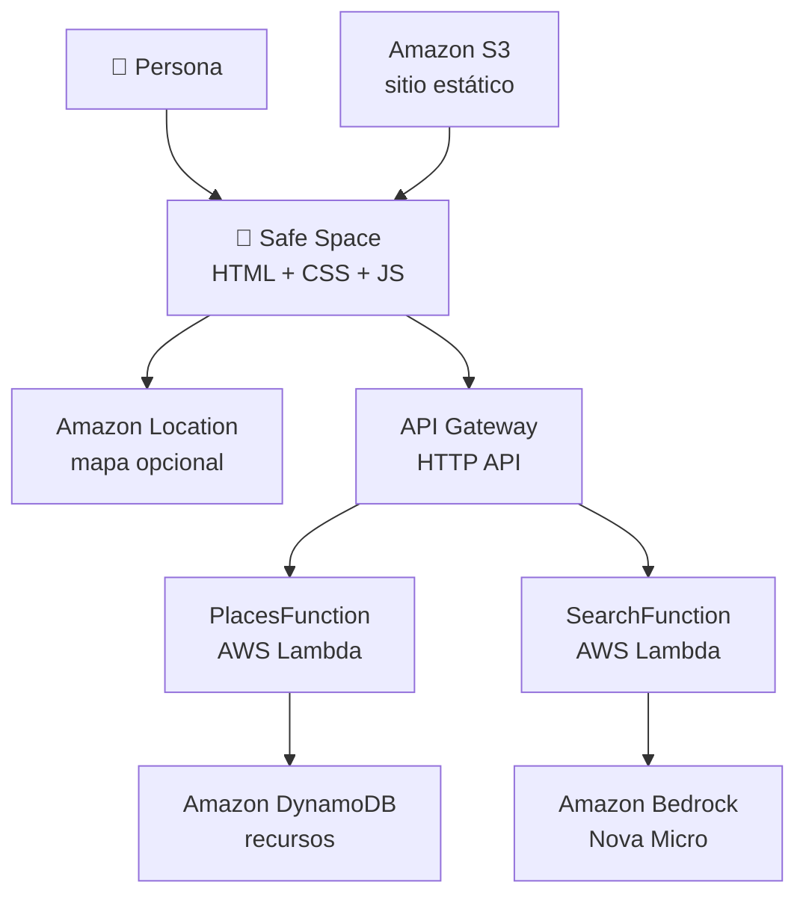

<div align="center">

# 🌈 Safe Space

**Directorio de recursos inclusivos con procedencia visible · Ciudad de México**

Workshop de [AWSpectrum LATAM](https://linktr.ee/awspectrum.latam) · *Cloud • Community • Diversity*

[](https://awspectrum-impact-lab.vercel.app)
[](template.yaml)
[](functions/)
[](LICENSE)

</div>

Safe Space ayuda a encontrar organizaciones, servicios de apoyo, centros comunitarios y canales de
derivación. Los recursos con ubicación pública aparecen en el mapa; los que funcionan por teléfono,
chat o canalización se muestran solo como fichas de contacto.

> [!IMPORTANT]
> **Safe Space no certifica que un recurso sea seguro ni que esté disponible.** Muestra su fuente,
> la fecha en que se revisó y su estado de publicación, y deja que quien lo lee juzgue. Las
> derivaciones a refugios nunca publican la dirección protegida.

En tres horas vas a desplegar esta aplicación en tu propia cuenta de AWS, recorrerla por dentro y
cambiarla. No la escribes desde cero: **el objetivo es salir pudiendo contar el camino de una
petición y explicar por qué existe cada servicio.**

## 👉 Empieza por la guía

Este README describe el repositorio. El taller se sigue en la guía, que son ocho paradas con sus
comandos, sus comprobaciones y sus rescates:

### **[awspectrum-impact-lab.vercel.app](https://awspectrum-impact-lab.vercel.app)**

## La arquitectura, de un vistazo



| Servicio | La pregunta que responde |
| --- | --- |
| **Amazon S3** | ¿Dónde vive la página? |
| **API Gateway** | ¿Quién recibe la petición? |
| **AWS Lambda** | ¿Dónde corre la lógica? |
| **Amazon DynamoDB** | ¿Dónde persisten los datos? |
| **Amazon Bedrock** · Nova Micro | ¿Cómo entendemos una frase escrita por una persona? |
| **Amazon Location** | ¿Cómo dibujamos lo que sí es público? |
| **AWS SAM** | ¿Cómo se crea y se borra todo esto de una vez? |

Todo vive en **`us-east-1`**.

## Puesta en marcha

No necesitas instalar nada: ni AWS CLI, ni SAM, ni Python, ni Docker. Solo una cuenta de GitHub y
una cuenta de AWS con acceso a la consola.

1. **Fork** de este repositorio a tu cuenta.
2. En tu fork: **Code ▸ Codespaces ▸ Create codespace on main**, máquina de **2 núcleos**.
3. Ya en la terminal del Codespace:

```bash
aws login --remote --region us-east-1   # sesión temporal de 12 h, sin access keys
aws sts get-caller-identity             # ¿quién soy para AWS?

./scripts/preflight.sh                  # solo lee: comprueba que tu entorno puede desplegar
sam build && sam deploy                 # ~1 min
./scripts/publish-frontend.sh           # genera config.js, sube el sitio e imprime tu URL
python3 scripts/seed.py                 # carga los 11 recursos del directorio
```

El seed es idempotente: cada recurso tiene un `id` fijo y sobrescribe el mismo item. `--replace`
existe, y borra lo anterior antes de cargar.

> [!NOTE]
> **Tener la AWS CLI no es lo mismo que estar autenticada en AWS.** El Codespace traía la CLI; el
> `aws login` es lo que abre la sesión. Va con `--remote` porque el Codespace es una máquina sin
> navegador: en vez de abrirlo él, te da una URL para que la abras tú.

<details>
<summary><b>Si tu cuenta no funciona con <code>aws login</code></b></summary>

| Tu cuenta | Qué hacer |
| --- | --- |
| **IAM Identity Center** (empresa o escuela) | `aws login` no sirve: `aws configure sso` una vez y después `aws sso login` |
| **Usuario IAM** con error de permisos | Pide la policy gestionada `SignInLocalDevelopmentAccess` |
| **Root** | Nada más |

Si ninguna funciona, el taller entero corre en **AWS CloudShell** (`us-east-1`), donde las
credenciales son automáticas: `git clone` del repo y sigue desde `preflight.sh`. Lo único que
pierdes es comodidad para editar.

</details>

## El repositorio

```text
.devcontainer/     el entorno reproducible: Python 3.13, AWS CLI, SAM, gh (versiones fijadas)
template.yaml      toda la infraestructura, en un archivo
functions/places/  Lambda de GET/POST /resources — valida y publica
functions/search/  Lambda de POST /search — la que habla con Bedrock
frontend/          la interfaz: HTML, CSS y JavaScript sin framework
data/seed.json     los 11 recursos, cada uno con su fuente y su fecha de revisión
scripts/           preflight · publish-frontend · seed · cleanup
tests/             8 pruebas del contrato, sin llamadas a AWS
```

Tres rutas, y nada más:

```text
GET  /resources  → los recursos aprobados
POST /resources  → guarda una propuesta como pending
POST /search     → convierte lenguaje natural en criterios
```

```bash
API=$(aws cloudformation describe-stacks --stack-name safe-space \
      --query "Stacks[0].Outputs[?OutputKey=='ApiUrl'].OutputValue" --output text)

curl -s "$API/resources" | python3 -m json.tool | head -14
```

## Cambiar algo

Ejecuta solo lo que corresponde a la capa que tocaste:

| Tocaste | Para verlo | Para comprobarlo antes |
| --- | --- | --- |
| `frontend/` | `./scripts/publish-frontend.sh` | `node --check frontend/app.js` |
| Código de una Lambda | `sam sync --code` | `python3 -m unittest discover -s tests -v` |
| `template.yaml` | `sam deploy` y luego `publish-frontend.sh` | `sam validate --lint` |
| `data/seed.json` | `python3 scripts/seed.py` | que sus `sourceUrl` abran |

Para iterar sin desplegar a mano, deja `sam sync --watch --stack-name safe-space` en otra terminal.
Ojo: **cada guardado sale de verdad hacia tu cuenta**.

## Las tres reglas del proyecto

### 1. Un recurso sin procedencia no se publica

Un registro real de `data/seed.json`:

```json
{
  "id": "usipt-cdmx",
  "name": "USIPT · Unidad de Salud Integral para Personas Trans",
  "category": "support_service",
  "services": ["psychological_support", "legal_support", "healthcare", "community_network"],
  "signals": ["lgbtq_affirming"],
  "latitude": 19.4545577,
  "longitude": -99.1509918,
  "contact": {
    "phone": "55 5132 1250 ext. 1354 · 55 5132 1250 ext. 1341",
    "website": "https://www.salud.cdmx.gob.mx/ver-mas/unidad-de-salud-integral-para-personas-trans-usipt"
  },
  "provenance": {
    "type": "direct_source",
    "sourceUrl": "https://www.salud.cdmx.gob.mx/ver-mas/unidad-de-salud-integral-para-personas-trans-usipt",
    "checkedAt": "2026-08-19"
  },
  "publicationStatus": "approved"
}
```

Un registro `approved` necesita `sourceUrl` y `checkedAt`. Lo que llega por el formulario queda
`pending` con `provenance.type = "community_submission"` y **nunca** se presenta como verificado.

`latitude` y `longitude` son opcionales pero van juntas, y una `shelter_referral` no puede tener
ninguna de las dos: la seguridad de quien usa un refugio pesa más que la completitud del mapa.

### 2. La IA interpreta; el código decide

Bedrock convierte *«necesito apoyo psicológico gratuito»* en `{category, services, signals}`. No
consulta DynamoDB, no elige recursos y no inventa teléfonos. Las Lambdas descartan cualquier valor
que no esté en la allowlist antes de que llegue al navegador. Si Bedrock no responde, `source` pasa
a `fallback` y la búsqueda sigue funcionando con palabras clave.

### 3. La taxonomía tiene una sola fuente de verdad

`template.yaml` la declara y se la pasa a las Lambdas; `publish-frontend.sh` la escribe en
`config.js` para dibujar los filtros.

| Dimensión | Valores |
| --- | --- |
| Categorías | `organization` · `support_service` · `community_center` · `shelter_referral` |
| Servicios | `psychological_support` · `legal_support` · `healthcare` · `referral` · `community_network` · `shelter_support` |
| Señales | `lgbtq_affirming` · `free` · `open_24_7` · `contact_only` |

> [!WARNING]
> `frontend/config.js` lleva la API key de Amazon Location de tu cuenta. Está en `.gitignore` y
> **no se commitea nunca**: lo regenera `publish-frontend.sh`.

## Al terminar

Saber apagar lo que encendiste es la otra mitad del trabajo. Cerrar la pestaña no borra nada.

```bash
./scripts/cleanup.sh   # vacía el bucket y ejecuta sam delete
aws logout             # cierra la sesión temporal
```

El script dice qué va a borrar antes de borrarlo, y comprueba que el stack sea de Safe Space: si le
apuntas a otro, se niega. Después, **detén o elimina tu Codespace** en
[github.com/codespaces](https://github.com/codespaces) — uno encendido consume tu cuota aunque no
lo uses.

Tu código sigue en tu fork. La infraestructura entera vuelve a existir con `sam deploy` cuando
quieras: para eso está descrita en un archivo.

## Esto es un taller, no producción

| Aquí | En producción |
| --- | --- |
| Sitio estático público en S3 | CloudFront o Amplify, bucket privado, HTTPS |
| API sin autenticación | Autenticación, autorización y límites de tasa |
| `Scan` de DynamoDB sobre once recursos | Índices y patrones de acceso diseñados |
| Seed aprobado + propuestas `pending` | Moderación, auditoría y revisión periódica |
| Coordenadas cuando la fuente ya las publica | Revisión de privacidad y amenaza, recurso por recurso |
| Una base de datos por participante | Backend comunitario compartido |

Saber dónde está esa frontera es parte de lo que se lleva del taller.

## Licencia

[MIT](LICENSE)
